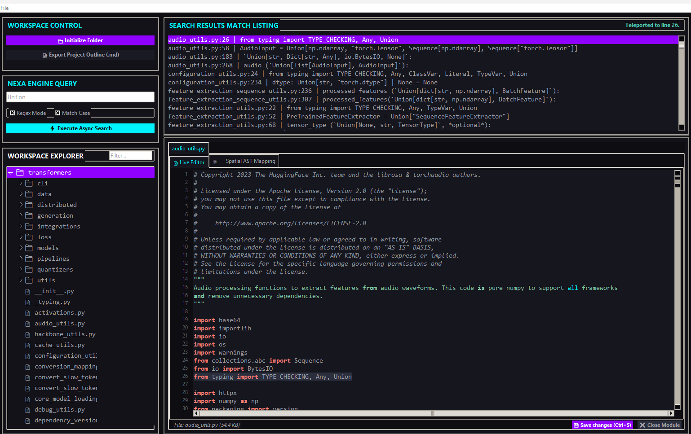
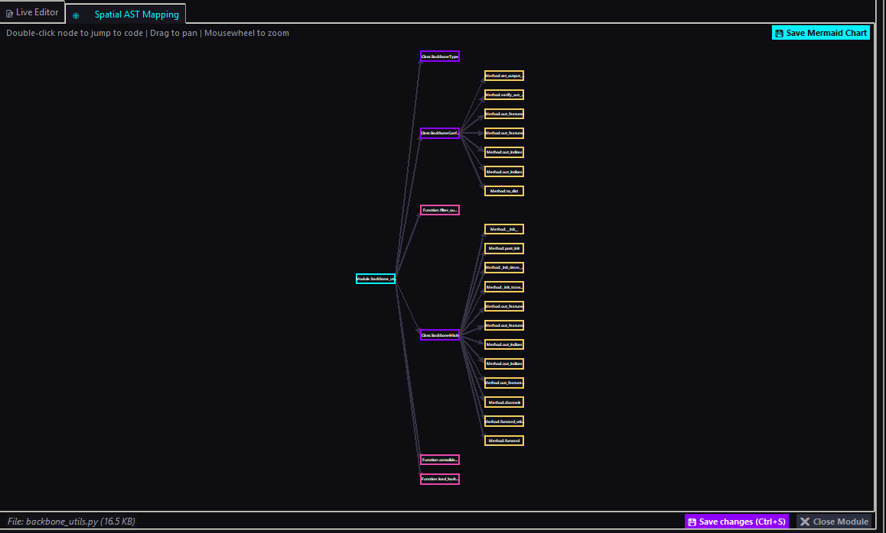

⚡ Nexa Core X - Code Intelligence IDE & Hybrid Search Engine

# NexaC_X
Aici vine descrierea proiectului tău...

Nexa Core X is a high-performance, local-first development environment designed as a zero-latency utility for analyzing, searching, editing, and spatially visualizing complex codebases. By merging the high-speed Nexa Search Engine with the advanced Spatial AST Mapping and Agent Visualizer Pro modules
🚀 Key Architectural Features

1. Honest Performance (Hybrid Core Engine)

Literal Search: Bypasses Python's re module entirely for simple searches, routing queries directly through CPython's native string matching algorithms (optimized at the C level in fastsearch.c using memchr).

Regex Fallback: Seamlessly toggles to the compiled C-regex engine for complex pattern matching.

Line Resolution in $\mathcal{O}(\log N)$: While character scanning is linear $\mathcal{O}(N)$, Nexa precomputes newline offsets during I/O. Mapping a byte-match to an exact line index is guaranteed to run in $\mathcal{O}(\log N)$ using binary search (bisect), eliminating the need to count lines iteratively.

Bounded Memory (Enterprise Safety): Enforces a strict 10MB per-file limit and caps search results at 10,000 matches per query. This prevents OS freezes and RAM exhaustion (OOM) during massive regex captures.

Native .gitignore Parser: Recursively excludes build directories, caches (__pycache__, .venv, node_modules), and binary files using standard fnmatch rules to maximize raw I/O throughput.

2. Bento-Grid Layout UI

Inspired by modern dashboard design trends, the workspace is organized into high-density aspherical Bento containers:

Workspace Control Panel: Quick-access cards for workspace folder initialization and project outline exports.

Nexa Search & Live Match Listing: Real-time asynchronous match visualization in a dedicated diagnostics list.

Multi-Tab Modular Environment: Every open code module hosts its own isolated tab panel (Live Editor, Spatial AST Map, and Agent Visualizer).

3. Spatial AST Topology & Viewport Teleportation (Logic Mapping)
4. 

Real-time AST Parsing: Automatically parses the Abstract Syntax Tree (ast) of Python files to map the logical structure of modules, classes, functions, and methods into interactive vector nodes.

Drift-Free Proportional Zoom: The scroll wheel zoom scales vector rectangles, anchors, and Bezier routing curves smoothly while keeping the font size within nodes fixed and highly readable. This prevents chaotic text overflows during macro zoom-out views.

Live Viewport Teleportation: Clicking or double-clicking any method or class box on the spatial map instantly switches the active view back to the Live Editor, scrolls to the targeted definition line, highlights it, and focuses the cursor for immediate editing.

Mermaid.js Exporter: Exports the logic topology directly to a standard Markdown (.md) file utilizing the Mermaid diagram syntax, ready to be rendered natively on GitHub/GitLab Wikis.

4. Agent Visualizer Pro (Ecosystem Sandbox)

An ultra-stylized physical network simulation sandbox integrated directly inside your workspace tabs:

Swarmalator Physics: An advanced spatial boids algorithm where node coordinates (representing classes, agents, tools, or tasks) are governed by differential equations modulated by their internal synchronization phases.

Kuramoto Waves (Continuous Telemetry): Visualizes connections as continuous phase-coupled oscillators, rendering animated wave pulses along network edges based on physical latency.

Integrate-and-Fire (Discrete Energy Bursts): Nodes progressively accumulate voltage until they hit a critical threshold ($1.0$), resetting themselves and shooting a discrete packet of energy down outgoing edges, applying a phase "kick" ($\varepsilon$) to connected neighbors.

Deep Meta-Scan (AST Reflection): Asynchronously scans Python trees to identify reflective code blocks (eval(), exec(), getattr(), globals(), locals()) and dynamic instantiation loops, mapping them as custom meta-nodes.

Topology Debugging: Allows direct clipboard extraction of connectivity matrices (orphan vs. connected agents), pulse latency profiles, and network telemetry.

5. Live Code Editor (Tokyo Night Edition)

A customized editor component with synchronized line numbering and syntax highlighting based on precise tag prioritization (tag_raise):

Comments & Docstrings: Soft green tones with maximum priority to prevent nested keyword conflicts.

Builtins & Special Values (Electric Cyan): Highlights native functions like print(), len(), isinstance(), and constants like True, False, and None.

Keywords (Tokyo Night Red): Distinct coloring for keywords like def, class, return, import, with, async, await, etc.

Numeric Elements (Neon Pink): Standardizes integers, floats, hexadecimals, binaries, and octals.

Decorators (Warm Orange): Identifies decorators like @property or @classmethod instantly.

Instance References (self/cls in italic gold): Visually isolates instance bindings for readability.

🛠️ Installation & Execution

Nexa Core X is built entirely on the Python Standard Library. No external pip installations are required.

Requirements

Python 3.10+ (Optimized for Python 3.11 and 3.12).

Tkinter (Required for GUI execution only).

GUI Launch

Launch the script directly from your desktop (double-click) or via terminal:

python nexa_core_x.py

Note for Linux Users (Debian/Ubuntu): If the interface fails to load due to a missing Tkinter module, install it using your package manager:

sudo apt install python3-tk
python nexa_core_x.py

Headless CLI Mode (Terminals / Remote Servers)

If you run inside a headless server environment or pass a query argument directly through the console, Nexa Core X will automatically execute as a fast, pipeline-friendly CLI utility:

Basic search in the current directory:

python nexa_core_x.py "your_search_query"

Advanced async search with regex and case-sensitivity:

python nexa_core_x.py "def\s+[a-z_]+" -d /path/to/project -r -c

Stdin Piping (UNIX Philosophy):

cat server_log.log | python nexa_core_x.py "ERROR"

Structured JSON output for toolchain integrations:

python nexa_core_x.py "TODO" --json | jq '.metrics'

⌨️ GUI Keybinds & Interactions

Shortcut / Action

Behavioral Effect in the IDE

Ctrl + O

Opens the directory dialog to initialize a new Workspace folder.

Ctrl + S

Persists editor changes to disk, updates the active search index, and redraws AST mappings.

Ctrl + Q

Safely exits the IDE, saving current workspace preferences to your local config.

ENTER (on search bar)

Executes an asynchronous search query across the active index.

Click / Double Click (on AST Nodes)

Teleports the code view to that class/method and switches view focus to the Live Editor.

Mouse Wheel (on AST / Visualizer maps)

Smooth, proportional (drift-free) viewport zoom.

Left Click + Drag (on AST / Visualizer maps)

Infinite 2D panning of the canvas viewport.

Right Click (on tree explorer items)

Opens the context menu (Show in Folder, Open Externally, Copy Absolute Path).

📁 Configuration File

Upon first exit, Nexa Core X generates a configuration file named nexa_core_x_config.json in its working directory. This retains:

The last opened workspace folder (for automatic re-loading upon startup).

Your recent workspace history (up to 8 directories).

Search state preferences (Match Case, Regex Mode).

⚖️ License

This project is distributed under the MIT License - see the LICENSE file for details.
